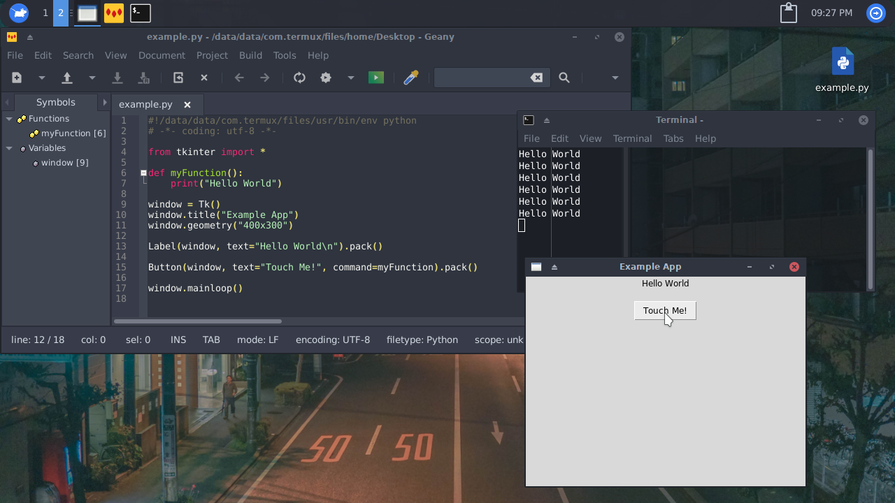

# Es posible crear apps con termux x11?

Actualmente existen muchas formas de crear apps en termux x11, las cuales son compatibles con 
linux, y su mayoria también con Windows, *BSD y MacOS.

> ejemplo de app creada en python usando la libreria tkinter



# Kits compatibles 

Actualmente en termux hay una gran lista de formas de hacer apps, te listaré las más usadas con sus 
lenguages más recomendados 

## Python

- [tkinter](https://www.javatpoint.com/python-tkinter) (La GUI oficial de python usando tcl/tk)
- [appJar](http://appjar.info/) (perfecto para novatos que quieren algo simple, usa tkinter como backend)
- [pyfltk](https://pyfltk.sourceforge.io/docs/CH0_Preface.html) (Algo viejo pero tiene lo suyo)
- [PySimpleGUI](https://github.com/PySimpleGUI/PySimpleGUI) (usa tkinter como backend, se destaca por ser util, simple y hermoso.)
- [PyQt5](https://github.com/PyQt5/PyQt) (El framework Qt portado a Python)

## Ruby 

- [tk](https://github.com/ruby/tk) (enlaces tcl/tk para ruby)

## C

- [GTK](https://www.gtk.org/) (GIMP toolkit, moderno, usado por los desarrolladores de GNOME)

## C++

- [fltk](https://www.fltk.org/) (Algo viejo, pero util.)
- [Qt](https://www.qt.io/) (Version 5, muy facil de usar y aprender, moderno, usado por KDE)

## Java 

- [swing](https://www.javatpoint.com/java-swing) (Facil y simple GUI toolkit para java)
- [AWT](https://es.m.wikipedia.org/wiki/Abstract_Window_Toolkit) (Viejo, reemplazado por swing, pero sigue siendo muy usado)

# Instalación 

## Python

### tkinter

```bash
pkg install python-tkinter gobject-introspection
```

### appJar

```bash
pkg install python-tkinter
pip install appJar
```

### pyFLTK

```bash
pkg install fltk gobject-introspection
pip install pyfltk
```

### PySimpleGUI

```bash
pkg install python-tkinter
pip install PySimpleGUI
```
```bash
apt install python
pip install PyQt5
```

## Ruby 

### tk

```bash
pkg install gobject-introspection tcl tk ruby
gem install tk
```

## C

### GTK

```bash
pkg install clang gtk3
```
También puede usar gtk4 o gtk2, personalmente recomiendo usar gtk3 / gtk+ , o gtk2

## C++

### FLTK

```bash
pkg install clang fltk
```

### Qt Widgets

```bash
pkg install clang qt5-qtbase qt5-qttools
```

también puede instalar su IDE (recomendado) `pkg install qt-creator`

## Java

### Swing y AWT

No hay que hacer nada, ya vienen incuidos por defecto

```bash
pkg install openjdk-17 libx11
```

# Notas

Recuerda que pueden haber más, solo listé los más conocidos, si conoces alguno y funciona en termux
x11 por favor añadelo y aceptaré cualquier colaboración con estas páginas.


