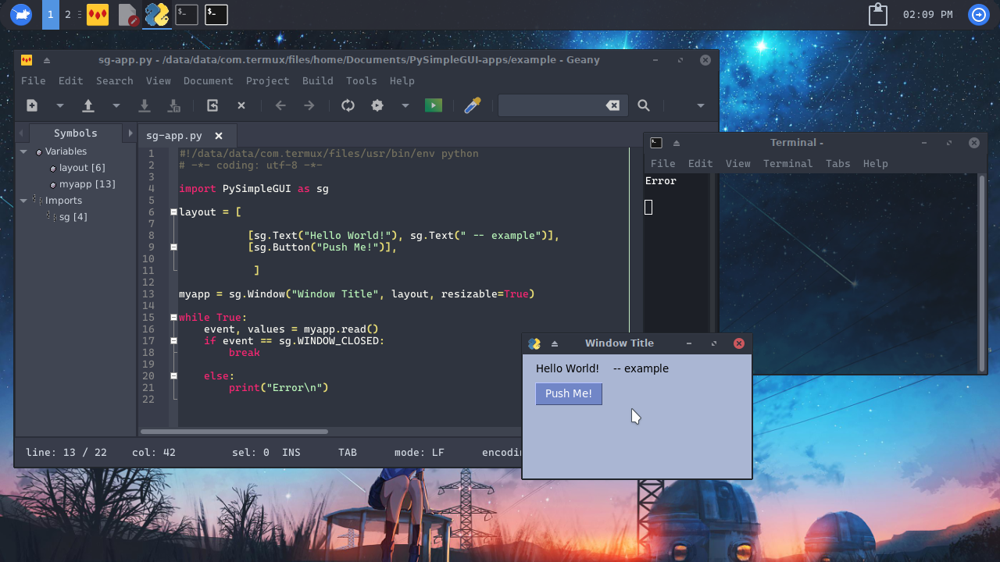
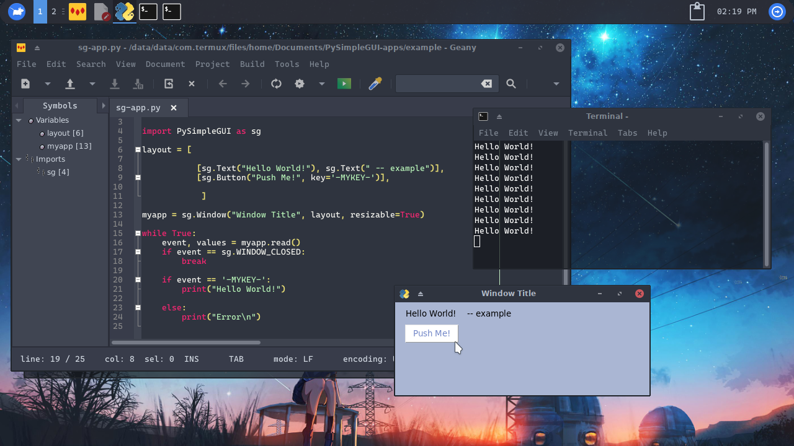

# sg - PySimpleGUI

En PySimpleGUI el desarrollo de apps es muy sencillo, con el podrás crear simples y bonitas 
apps sin necesidad de tener mucha experiencia.

# Empezando

Para usa PySimpleGUI debemos importarlo de esta forma:

```python
import PySimplegui as sg
```

luego creamos la raíz de la ventana

```python 
layout = [

           [sg.Text("Hello World!"), sg.Text(" -- example")], 
           [sg.Button("Push Me!")]
     
            ]
```

luego definimos la ventana de esta forma:

```python
myapp = sg.Window("Window Title", layout, resizable=True)
```

myapp puede tener otro nombre, ya que esto es una variable, en sg.Window() tenemos 3 cosas,
la primera es el titulo de la ventana, la segunda incluye el contenido y la ultima dice 
que sí se puede cambiar su tamaño.

Luego de haber echo esto creamos un bucle que contendrá los eventos de la ventana.

```python
while True:
	event, values = myapp.read()
	if event == sg.WINDOW_CLOSED:
		break
		
	else:
		print("Error\n")
```

En este bucle se leen los eventos y valores de la ventana que creamos, en mi caso la llamé
myapp como variable.

el primer evento rompe el bucle en caso de que se precione el botón de cerrar la ventana,
el segundo imprimirá error en caso de un error.

**resultado**



También podemos añadir un evento al botón y el bucle usando una key, ejemplo:


```python
layout = [

           [sg.Text("Hello World!"), sg.Text(" -- example")], 
           [sg.Button("Push Me!", key='-MYKEY-')]
     
            ]
```

luego añadimos una acción al botón en el bucle:

```python
while True:
	event, values = myapp.read()
	if event == sg.WINDOW_CLOSED:
		break
		
	if event == '-MYKEY-':
	    print("Hello World!")
		
	else:
		print("Error\n")
```

De esta forma hemos añadido un evento llamado "-MYKEY-", el cual es leido en la condición
que pusimos en el bucle, al cumplirse esa condición se ejecutará el código que pongamos ahí.

**resultado**



### Código completo:

```python

#!/data/data/com.termux/files/usr/bin/env python
# -*- coding: utf-8 -*-

import PySimpleGUI as sg

layout = [

           [sg.Text("Hello World!"), sg.Text(" -- example")], 
           [sg.Button("Push Me!", key='-MYKEY-')],
     
            ]

myapp = sg.Window("Window Title", layout, resizable=True)

while True:
	event, values = myapp.read()
	if event == sg.WINDOW_CLOSED:
		break
		
	if event == '-MYKEY-':
		print("Hello World!")
		
	else:
		print("Error\n")
		
```

Estás pagínas se llenarán con el tiempo, gracias por leer, si desea colaborar escribame 

`yisus7u7v@gmail.com`

O telegram: 

@Yisus7u7v - only english or spanish
